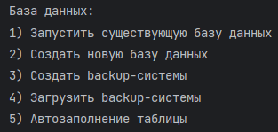
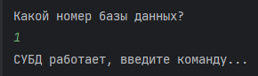
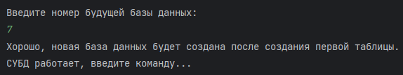
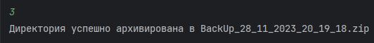
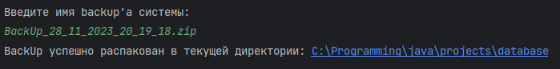
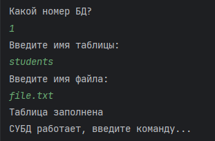

<h1 align="center">СУБД на Java</h1>
<p>Реализация простой системы управления базами данных (СУБД) на чистом языке программирования Java, 
где таблицы хранятся в виде текстовых документов.</p>
<h3>Инструкция по использованию:</h3>
<p>При запуске программы нас встречает меню, где можно выбрать нужное нам действие</p>
<p align="center"> 
</p>

<p><li>При выборе первого варианта необходимо указать номер базы данных.</p>
<div></div>

<p><li>При выборе второго варианта нужно ввести новый номер базы данных, который ещё не был использован в системе.</p>
<div></div>

<p><li>При выборе третьего варианта создается архив, содержащий все ранее созданные базы данных.</p>
<div></div>

<p><li>При выборе четвертого варианта предлагается ввести полное имя архива с расширением (.zip)</p>
<div></div>

<p><li>При выборе пятого варианта предлагается ввести номер базы данных, затем указать название таблицы, которую необходимо заполнить,
и, наконец, ввести имя файла (.txt) с форматом разделения колонок пробелом.</p>
<div></div>

<h4>Команды для работы с СУБД</h4>
<p><li>Создание таблицы в базе данных</p>
<p>```create имя_таблицы (agr1 type, arg2 type2, ... , argN typeN)```</p>
<br>
<p><li>Добавление ряда в таблицу</p>
<p>```insert into имя_таблицы values (arg1, arg2, ... , argN)```</p>
<br>
<p><li>Выборка из таблицы</p>
<p>```select колонка1, ... , колонкаN from имя таблицы или select * from имя_таблицы```</p>
<br>
<p><li>Объединение таблиц</p>
<p>```inner join имя_таблицы1 from имя_таблицы2 on имя_колонки```</p>
<br>
<p><li>Добавление в таблицу значения</p>
<p>```add into имя_таблицы column название_колонки тип_колонки```</p>
<br>
<p><li>Обновление значения в таблице</p>
<p>```update имя_таблицы set имя_колонки=значение where имя_колонки=значение```</p>
<br>
<p><li>Удаление значения из таблицы</p>
<p>```delete from имя_таблицы where имя_колнки=значение_колонки```</p>
<br>
<br>
<p>На данный момент программа находится в несовершенном виде.</p>
<br>


